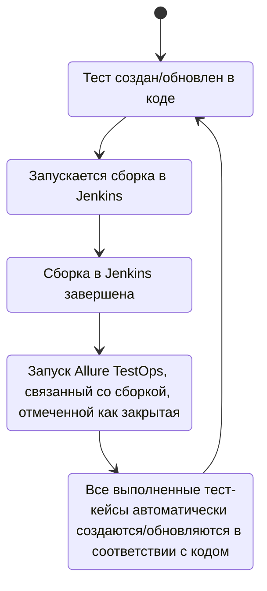

# Test automation project for [Bank of Russia](https://www.cbr.ru/)

<p align="center">  
<a href="https://www.cbr.ru/"></a>
</p>

Bank of Russia — The Central Bank of the Russian Federation is the main issuing bank and monetary regulator of the country.


# <a name="Содержание">Содержание</a>
+ [Описание](#Описание)
+ [Технологии и инструменты](#Технологии-и-инструменты)
+ [Варианты запуска](#Варианты-запуска)
    + [Команды для gradle](#команды-для-gradle)
    + [Запуск в Jenkins](#запуск-в-jenkins)
+ [Telegram уведомления](#Telegram-уведомления)
+ [Результаты тестов в Allure Report](#Результаты-тестов-в-Allure-Report)
+ [Интеграция с Allure TestOps](#Интеграция-с-Allure-TestOps)
+ [Интеграция с Jira](#Интеграция-с-Jira)
+ [Видео запуска тестов](#Видео-запуска-тестов)


# <a name="Описание">Описание</a>
Тестовый проект состоит из веб-тестов (UI)
Краткий список интересных фактов о проекте:
- [x] `Page Object` проектирование
- [x] Параметризованные тесты
- [x] Различные файлы конфигурации для запуска теста в зависимости от параметров сборки
- [x] Конфигурация с библиотекой `Owner`
- [x] Интеграция с `Allure TestOps`
- [x] Автотесты как тестовая документация
- [x] Интеграция с `Jira`


## <a name="Technologies and Tools">**Technologies and Tools:**</a>

| Java                                                                                                      | IntelliJ Idea                                                                                                                 | GitHub                                                                                                     | JUnit 5                                                                                                           | Gradle                                                                                                     | Selenide                                                                                                         | Selenoid                                                                                                                  |  Jenkins                                                                                                           |
|:----------------------------------------------------------------------------------------------------------|-------------------------------------------------------------------------------------------------------------------------------|------------------------------------------------------------------------------------------------------------|-------------------------------------------------------------------------------------------------------------------|------------------------------------------------------------------------------------------------------------|------------------------------------------------------------------------------------------------------------------|---------------------------------------------------------------------------------------------------------------------------|-------------------------------------------------------------------------------------------------------------------:|
| <a href="https://www.java.com/"></a>  | <a id ="tech" href="https://www.jetbrains.com/idea/"></a> | <a href="https://github.com/"></a> | <a href="https://junit.org/junit5/"></a> | <a href="https://gradle.org/"></a> | <a href="https://selenide.org/"></a> | <a href="https://aerokube.com/selenoid/"></a> |   <a href="https://www.jenkins.io/"></a> |


| Jira                                                                                                                          | Allure                                                                                                                     | Allure TestOps                                                                                                          |
|:------------------------------------------------------------------------------------------------------------------------------|----------------------------------------------------------------------------------------------------------------------------|-------------------------------------------------------------------------------------------------------------------------|
| <a href="https://www.atlassian.com/ru/software/jira"></a> | <a href="https://github.com/allure-framework"></a> | <a href="https://qameta.io/"></a>    |


Автотесты в этом проекте написаны на `Java` использую `Selenide` фреймворк.\
`Gradle` - используется как инструмент автоматизации сборки.  \
`JUnit5` - для выполнения тестов.\
`Jenkins` - CI/CD для запуска тестов удаленно.\
`Selenoid` - для удаленного запуска браузера в `Docker` контейнерах.\
`Allure Report` - для визуализации результатов тестирования.\
`Telegram Bot` - для уведомлений о результатах тестирования.\
`Allure TestOps` - как система управления тестированием.

[Вернуться к оглавлению ⬆](#Содержание)


# <a name="Реализованные проверки">Реализованные проверки</a>
Тестовый проект состоит из веб-тестов (UI)
Краткий список интересных фактов о проекте:
- [x] Проверка наличия основных элементов главной страницы
- [x] Проверка языка по умолчанию на главной странице
- [x] Проверка доступных языков на главной странице
- [x] Проверка переключения языка на английский / русский
- [x] Проверка перехода по ссылкам социальных сетей
- [x] Checking the operation of the 1st level menu items
- [x] Checking the content of the first level menu items
- [x] Checking the content of the second level menu items

# <a name="Варианты запуска">Варианты запуска</a>

## <a name="GradleCommand">Команды для Gradle</a>
Для запуска локально и в Jenkins используется следующая команда::
```bash
gradle clean <tag>  -Dplatform=<platform>
```
Дополнительные параметры:
> `-DbrowserWithVersion` - для передачи браузера и версии        
> `-DbrowserSize` - для передачи разрешения  

`tag` - теги для запуска выполнения тестов:
>- *networks*
>- *smoke*
>- *regress*
 
`platform` - определяет среду для запуска этих тестов:
>- *local* - для запуска тестов локально
>- *remote* - для запуска тестов удаленно на selenoid

Дополнительные свойства извлекаются из соответствующего файла конфигурации (в зависимости от значения `platform`):
```bash
./resources/config/${platform}.properties
```

## <a name="Локальный запуск">Локальный запуск</a>
Конфиденциальная информация (имена для входа и пароли) хранится в зашифрованном виде в хранилище учетных данных Jenkins.
И  безопасно передается в сборку аргументами gradle, а его значения маскируются в логах.

Если вы хотите использовать данный проект локально (на своем ПК), вам потребуется создать файлы конфигурации.

`local.properties` - локальный запуск тестов со следующими параметрами:
>- *browserWithVersion*
>- *browserSize*
>- *baseUrl=*

Пример файла
>- *browserWithVersion=chrome,113.0*
>- *browserSize=1920x1080*
>- *baseUrl=yourSite.com*

`remote.properties` - удаленный запуск тестов со следующими параметрами:
>- *browserWithVersion*
>- *browserSize*
>- *baseUrl*
>- *remoteDriverUrl*
>- *userNameSelenoid*
>- *passwordSelenoid*
   
Пример файла
>- *browserWithVersion=chrome,113.0*
>- *browserSize=1920x1080*
>- *baseUrl=yourSite.com*
>- *remoteDriverUrl=remoteDriverUrl.com*
>- *userNameSelenoid=Login*
>- *passwordSelenoid=Password*


[Вернуться к оглавлению ⬆](#Содержание)

## <a name="Запуск в Jenkins">Запуск в [Jenkins](https://jenkins.autotests.cloud/job/demo_ui_cbr/)</a>
Главная страница сборки:
<p  align="center">

</p>

Параметризованное задание Jenkins может быть запущено с необходимыми 
***tag***  
***platform***
***browserWithVersion***  
***browserSize***
***baseUrl***

<p  align="center">

</p>

После завершения сборки результаты тестирования доступны в:
>- <code><strong>*Allure Report*</strong></code>
>- <code><strong>*Allure TestOps*</strong></code> 

[Вернуться к оглавлению ⬆](#Содержание)

# <a>Telegram уведомления</a>
Telegram-бот отправляет краткий отчет в указанный телеграм-чат по результатам каждой сборки.
<p  align="center">

</p>

Если вы хотите использовать данный проект для отправки отчета в ваш телеграм-чат, вам потребуется создать файл конфигурации.

Пример файла `config.json`
<p  align="center">

</p>


[Вернуться к оглавлению ⬆](#Содержание)

# <a name="AllureReport">Результаты тестов в [Allure Report](https://jenkins.autotests.cloud/job/dostavka.magnit.ru/19/allure/)</a>

## Главная страница
Главная страница отчета Allure содержит следующие блоки:

>- <code><strong>*ALLURE REPORT*</strong></code> - отображает дату и время теста, общее количество запущенных тестов, а также диаграмму с процентом и количеством успешных, упавших и сломавшихся в процессе выполнения тестов
>- <code><strong>*TREND*</strong></code> - отображает тенденцию выполнения тестов для всех запусков
>- <code><strong>*SUITES*</strong></code> - отображает распределение тестов по сьютам
>- <code><strong>*CATEGORIES*</strong></code> - отображает распределение неудачных тестов по типам дефектов
<p align="center">
  
</p>

## Список тестов с шагами и тестовыми артефактами
На странице список тестов, сгруппированных по наборам, с указанием статуса для каждого теста.\
Может быть показана полная информация о каждом тесте: теги, продолжительность, подробные шаги.

<p align="center">
  
</p>

Также доступны дополнительные тестовые артефакты:
>- Screenshot
>- Page Source
>- Video
>- Browserstack full info link

<p align="left">
  
</p>

[Вернуться к оглавлению ⬆](#Содержание)

# <a>Интеграция с [Allure TestOps](https://allure.autotests.cloud/project/2993/dashboards)</a>
> Ссылка доступна только авторизованным пользователям.

Тест-кейсы в проекте импортируются и постоянно обновляются из кода,
поэтому нет необходимости в синхронизации ручных тест-кейсов и автотестов.\
Достаточно создать и обновить автотест в коде и тест-кейс всегда будет в актуальном состоянии.

## Allure TestOps Dashboard

<p align="center">
  
</p>

<p align="center">
  
</p>



## Allure TestOps Test Cases

<p align="center">
  
</p>

[Вернуться к оглавлению ⬆](#Содержание)

# <a>Интеграция с Jira</a>
<p align="center">
  
</p>

[Вернуться к оглавлению ⬆](#Содержание)

# <a>Видео запуска тестов</a>

<p align="center">
  
</p>

[Вернуться к оглавлению ⬆](#Содержание)
