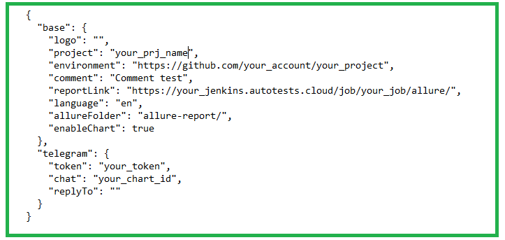

# <a name="Test automation project ">Test automation project for [Bank of Russia](https://www.cbr.ru/) website</a>

<p align="center">  
<a href="https://www.cbr.ru/"></a>
</p>

Bank of Russia — The Central Bank of the Russian Federation is the main issuing bank and monetary regulator of the country.

# <a name="Contents">Contents</a>
+ [Description](#Description)
+ [Technologies and Tools](#technologies-and-tools)
+ [Implemented checks](#implemented-checks)
+ [Launch Options](#launch-options)
    + [Launch Local](#launch-local)
    + [Run in Jenkins](#run-in-jenkins)
+ [Telegram notifications](#telegram-notifications)
+ [Test results in Allure Report](#test-results-in-allure-report)
+ [Integration with Allure TestOps](#integration-with-allure-testops)
+ [Integration with Jira](#integration-with-jira)
+ [Test run video](#test-run-video)

# <a name="Description">Description</a>
Test project consists of web tests (UI)
A short list of interesting facts about the project:
- [x] `Page Object` design
- [x] Parameterized tests
- [x] Different config files to run test depending on build options
- [x] Configuration with `Owner` library
- [x] Integration with `Allure TestOps`
- [x] Autotests as test documentation
- [x] Integration with `Jira`

# <a name="Technologies and Tools">Technologies and Tools</a>

| Java                                                                                                      | IntelliJ Idea                                                                                                                 | GitHub                                                                                                     | JUnit 5                                                                                                           | Gradle                                                                                                     | Selenide                                                                                                         | Selenoid                                                                                                                  |                                                                                                          Jenkins |
|:----------------------------------------------------------------------------------------------------------|-------------------------------------------------------------------------------------------------------------------------------|------------------------------------------------------------------------------------------------------------|-------------------------------------------------------------------------------------------------------------------|------------------------------------------------------------------------------------------------------------|------------------------------------------------------------------------------------------------------------------|---------------------------------------------------------------------------------------------------------------------------|-----------------------------------------------------------------------------------------------------------------:|
| <a href="https://www.java.com/"></a>  | <a id ="tech" href="https://www.jetbrains.com/idea/"></a> | <a href="https://github.com/"></a> | <a href="https://junit.org/junit5/"></a> | <a href="https://gradle.org/"></a> | <a href="https://selenide.org/"></a> | <a href="https://aerokube.com/selenoid/"></a> | <a href="https://www.jenkins.io/"></a> |

| Jira                                                                                                                          | Allure                                                                                                                     | Owner                                                                                                                                                             | Telegram                                                                                                                                   | Allure TestOps                                                                                                       |
|:------------------------------------------------------------------------------------------------------------------------------|----------------------------------------------------------------------------------------------------------------------------|-------------------------------------------------------------------------------------------------------------------------------------------------------------------|--------------------------------------------------------------------------------------------------------------------------------------------|----------------------------------------------------------------------------------------------------------------------|
| <a href="https://www.atlassian.com/ru/software/jira"></a> | <a href="https://github.com/allure-framework"></a> | <a href="https://eliasnogueira.com/easily-manage-properties-files-in-java-with-owner/"></a> | <a href="https://github.com/telegramdesktop/tdesktop"></a> | <a href="https://qameta.io/"></a> |

The autotests in this project are written in `Java` using the `Selenide` framework.\
`Gradle` - used as a build automation tool. \
`JUnit5` - for running tests.\
`Jenkins` - CI/CD for running tests remotely.\
`Selenoid` - for launching a browser remotely in `Docker` containers.\
`Allure Report` - for visualization of test results.\
`Telegram Bot` - for notifications about test results.\
`Jira` - commercial bug tracking system for organizing interaction with users \
`Owner` - library for management of properties files in Java \
`Allure TestOps` - as a test management system.

[Back to Contents ⬆](#Contents)

# <a name="Implemented checks">Implemented checks</a>
Test project consists of web tests (UI)
A short list of interesting facts about the project:
- [x] Check for the presence of the main elements of the main page
- [x] Check default language on main page
- [x] Check for available languages on homepage
- [x] Check language switching to English / Russian
- [x] Social link checker
- [x] Checking the operation of the 1st level menu items
- [x] Checking the content of the first level menu items
- [x] Checking the content of the second level menu items

[Back to Contents ⬆](#Contents)

# <a name="Launch Options">Launch Options</a>
## <a name="Launch Local">Launch Local</a>

To run locally and in Jenkins use the following command:
```bash
gradle clean <tag> -Dplatform=<platform>
```
Extra options:
> `-DbrowserWithVersion` - to pass browser and version
> `-DbrowserSize` - to pass permission

`tag` - tags to start running tests:
>- *networks*
>- *smoke*
>- *regression*

`platform` - specifies the environment to run these tests:
>- *local* - to run tests locally
>- *remote* - to run tests remotely on selenoid

Additional properties are retrieved from the corresponding configuration file (depending on the value of `platform`):
```bash
./resources/config/${platform}.properties
```

[Back to Contents ⬆](#Contents)

## <a name="Run in Jenkins">Run in [Jenkins](https://jenkins.autotests.cloud/job/demo_ui_cbr/)</a>
> The link is available only to authorized users.

Build main page:
<p  align="center">

</p>

Parameterized Jenkins job can be run with the required parameters:

>- *tag*
>- *platform*
>- *browserWithVersion*
>- *browserSize*
>- *baseUrl*

<p  align="center">

</p>

After the build is complete, the test results are available in:
>- <code><strong>*Allure Report*</strong></code>
>- <code><strong>*Allure TestOps*</strong></code> 

[Back to Contents ⬆](#Contents)

# <a>Telegram notifications</a>
Telegram-бот sends a short report to the specified telegram chat based on the results of each build.
<p  align="center">

</p>

If you want to use this project to send a report to your telegram chat, you will need to create a configuration file.

Example `config.json` file
<p  align="center">

</p>

[Back to Contents ⬆](#Contents)

# <a name="AllureReport">Test results in [Allure Report](https://jenkins.autotests.cloud/job/demo_ui_cbr/allure/)</a>
> The link is available only to authorized users.

## Main page
The main page of the Allure report contains the following blocks:
>- <code><strong>*ALLURE REPORT*</strong></code> - displays the date and time of the test, the total number of tests run, as well as a chart with the percentage and number of successful, failed and broken tests during the execution of tests
>- <code><strong>*TREND*</strong></code> - displays the test execution trend for all runs
>- <code><strong>*SUITES*</strong></code> - displays the distribution of tests by suite
>- <code><strong>*CATEGORIES*</strong></code> - displays the distribution of failed tests by defect type

<p align="center">
  
</p>

## List of tests with steps and test artifacts
On the page is a list of tests indicating the status for each test.
Full information about each test can be shown: tags, duration, detailed steps.

<p align="center">
  
</p>

Additional test artifacts are also available:
>- Screenshot
>- Page Source
>- Video
>- Browserstack full info link


[Back to Contents ⬆](#Contents)

# <a>Integration with [Allure TestOps](https://allure.autotests.cloud/project/3588/dashboards)</a>
> The link is available only to authorized users.

The test cases in the project are imported and constantly updated from the code,
therefore, there is no need to synchronize manual test cases and autotests.\
It is enough to create and update an autotest in the code and the test case will always be up to date.

## Allure TestOps Dashboard

<p align="center">
  
</p>

## Allure TestOps Test Cases

<p align="center">
  
</p>

[Back to Contents ⬆](#Contents)

# <a>Integration with [Jira](https://jira.autotests.cloud/browse/HOMEWORK-847)</a>
> The link is available only to authorized users.
<p align="center">
  
</p>

[Back to Contents ⬆](#Contents)

# <a>Test run video</a>

<p align="center">
  
</p>

[Back to Contents ⬆](#Contents)
